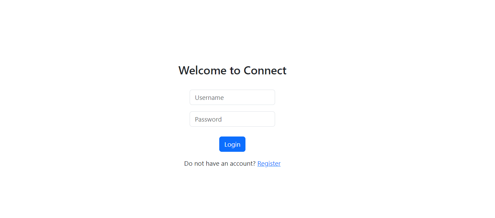
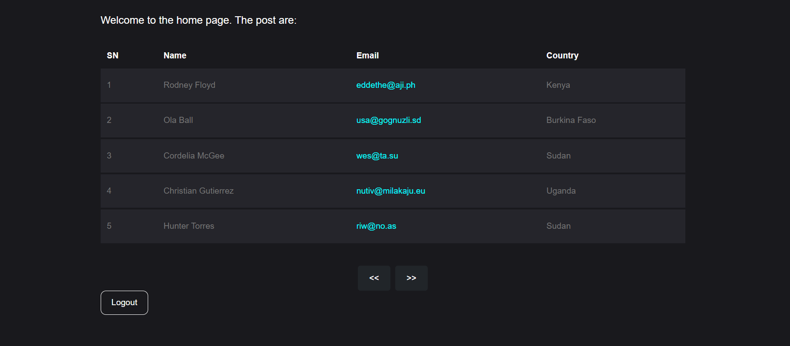
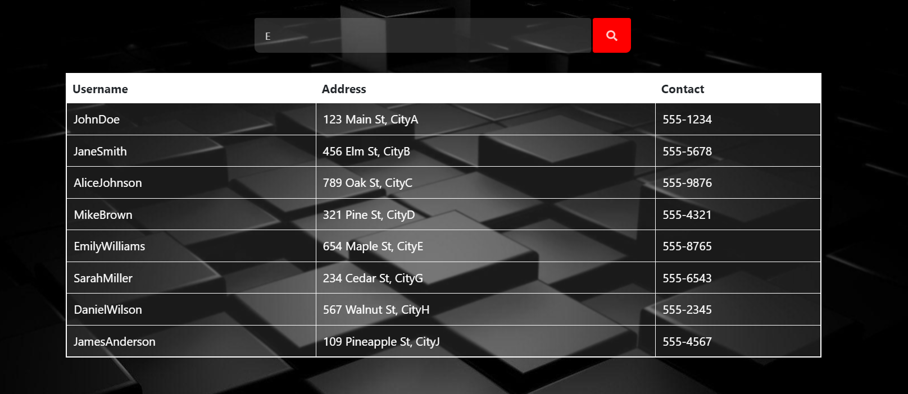

[](https://classroom.github.com/a/1F_pcGNd)

### Form validation with Php and MySQL database
  <div class="carousel-container">
    <div class="carousel">
      
      
      
    </div>
  </div>

### Ajax Search


#### Note:  
Change the **table_name** to your own table in MySQL database
```
<!-- home.php -->
$select_query = "SELECT * FROM table_name WHERE name = :username AND password = :password";

<!-- signup.php -->
$insert_query = "INSERT INTO table_name(name, password, address) VALUES (:username, :password, :address)";

<!-- server.php -->
$select_query = "SELECT username, address, contact FROM table_name WHERE username LIKE '%".$_GET['search']."%'";
```
